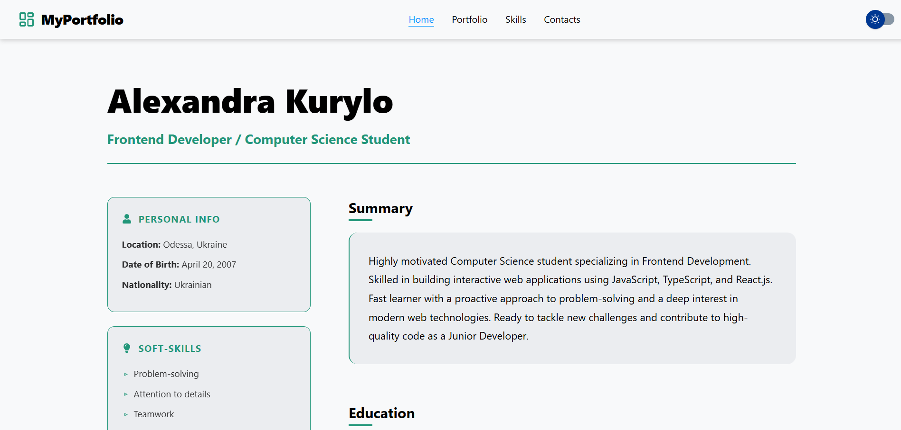
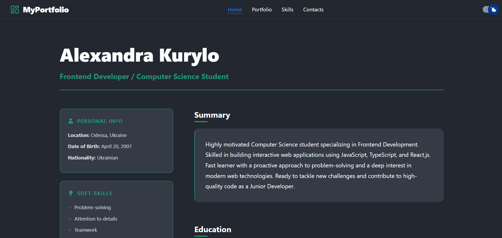
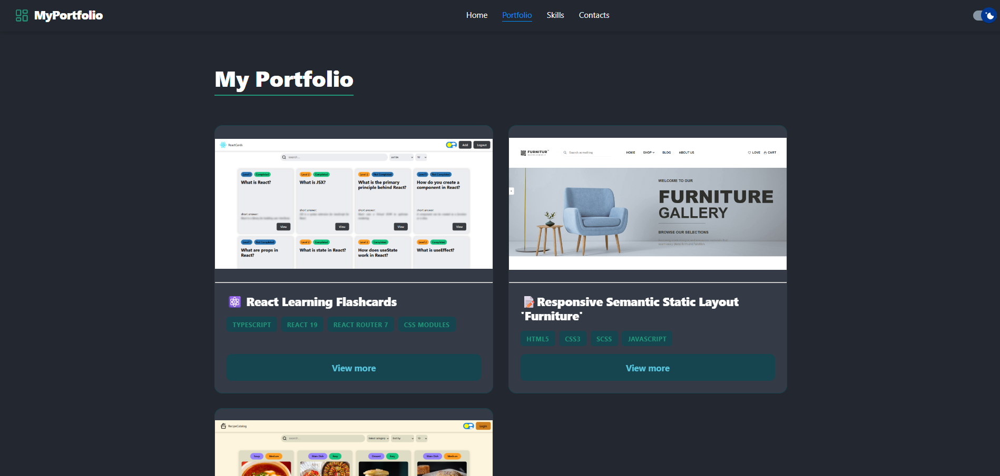
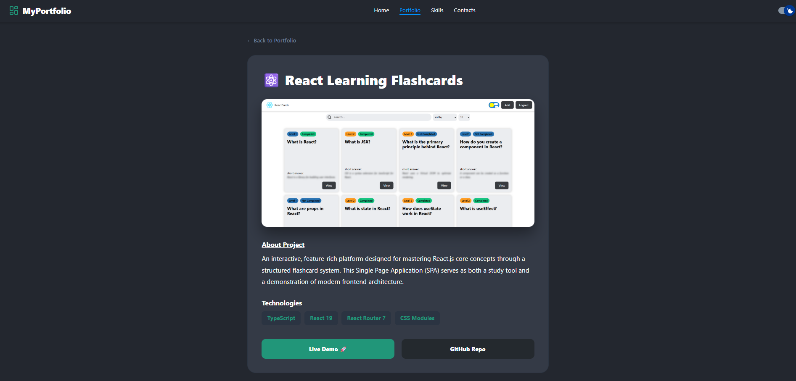
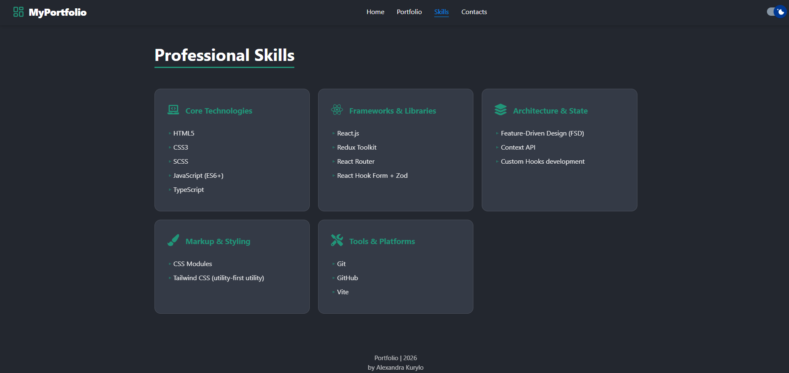
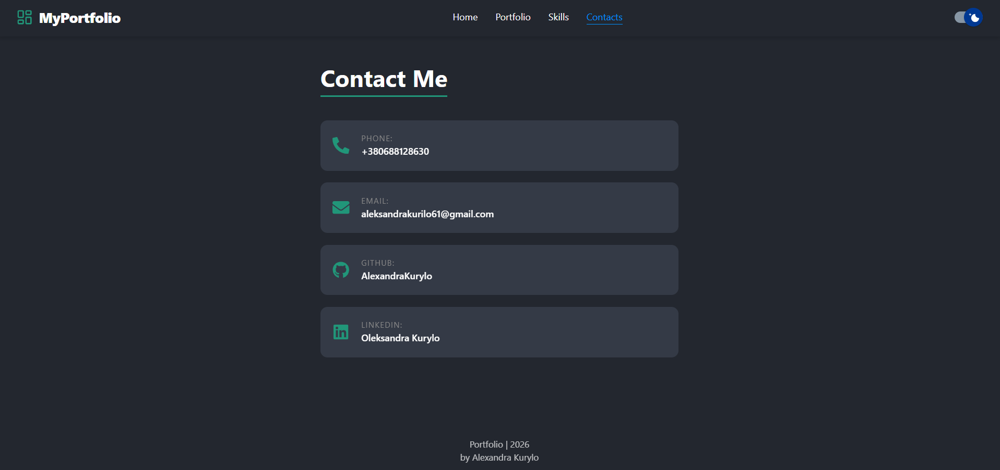

## Modern Portfolio Application

### 🌟 Project Overview

A high-performance portfolio application designed to showcase technical projects and professional expertise. The project is built with a focus on clean architecture, type safety, and a seamless user experience.

### 🏞️ Project Previews

<p align="center">
   
   
   
   
   
   
</p>

🔗 [Live Demo](https://my-portfolio-y0m2.onrender.com)

### 🚀 Key Features & Implementation

- Smooth Navigation: Client-side routing is implemented to ensure fast and fluid transitions between pages without full page reloads.

- Adaptive Theme System: A fully integrated Dark/Light mode toggle is available, with user preferences saved for future sessions.

- Smart Data Management: All project information is centralized in a dedicated configuration file, allowing for easy updates and scalability.

- Optimized Loading UX: Custom-designed loading animations are utilized during data fetching to maintain high user engagement.

- Mobile-First Design: The interface is fully responsive, providing an optimal viewing experience across all devices, from smartphones to desktops.

- Modular Architecture: The application is built using a "building block" (component-based) approach, ensuring that code is highly reusable and easy to maintain.

- Robust Type Safety: TypeScript is used throughout the project to prevent runtime errors and ensure consistent data structures.

- Custom Logic (Hooks): Specialized React hooks are developed to handle complex operations like asynchronous data fetching and UI state management.

- Isolated Styling: CSS Modules are used for component-level styling, preventing class name conflicts and keeping the codebase organized.

### 🛠 Technologies Used

- Core: React 19, TypeScript, Vite

- Routing: React Router 7

- Data Management: JSON Server (REST API Simulation)

- Icons & UI: React Icons

- Development Tools: ESLint, Prettier, Concurrently

- Automation: Generate React CLI

- Plugins: SVGR (SVG as React components)

- Styling: CSS Modules

### 📂 Folder Structure

```text
src/
├── assets/                 # Static assets (logos, project images, icons)
├── components/             # Reusable UI components
│   ├── ButtonLink/         # Styled navigation buttons
│   ├── Header/             # Site header and navigation menu
│   ├── Loader/             # Custom CSS loading spinner
│   ├── MainLayout/         # Global layout wrapper
│   ├── ProjectCard/        # Individual project card preview
│   └── ProjectList/        # Grid/List rendering of projects
├── constants/              # Static data and configuration
│   └── global.constants.ts # Global application constants
├── features/               # Complex functional modules
│   └── ThemeToggler/       # Theme switching logic & UI
├── helpers/                # Utility functions
│   └── delayFn.ts          # Function for simulating network latency
├── hooks/                  # Custom React hooks
│   ├──useDelayedLoader.ts
│   ├── useFetch.ts
│   └── useTheme.ts
├── pages/                  # Main route-level components
│   ├── HomePage/           # Personal intro and overview
│   ├── PortfolioPage/      # Projects showcase page
│   ├── ProjectPage/        # Individual project details
│   ├── SkillsPage/         # Technical and soft skills overview
│   └── ContactsPage/       # Reach out and contact form
├── theme/                  # Styling configuration & provider
│ ├── index.ts
│ └── ThemeProvider.tsx
├── types/                  # Global TypeScript definitions
│   ├── global.enums.ts
│   └── global.types.ts     # Shared application types
├── App.tsx                 # Main application entry point and routing
├── main.tsx                # Application entry point
└── index.css               # Global styles and CSS variables
```

### How to run a project locally

Open a terminal and run the command:

#### 1. Cloning a repository

```bash
git clone [https://github.com/AlexandraKurylo/my-portfolio.git](https://github.com/AlexandraKurylo/my-portfolio.git)
```

#### 2. Installing dependencies

```bash
   npm install
```

#### 3. Starting the database (Terminal 1)

```bash
   npm run server
```

#### 4. Launching the application (Terminal 2)

```bash
   npm run dev
```

#### 5. You can run the database and application with one command in one terminal

```bash
   npm run start:app
```
